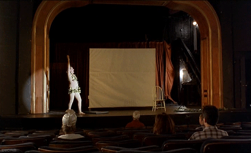
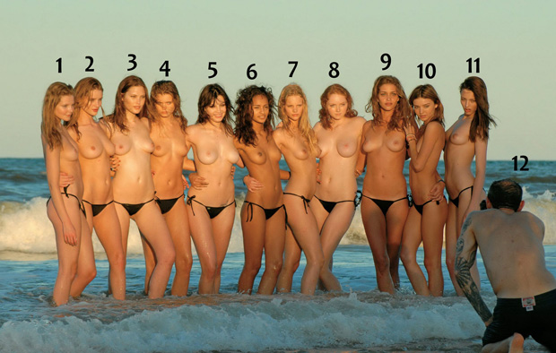
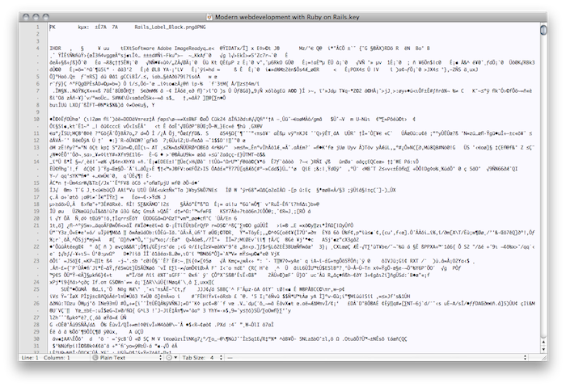
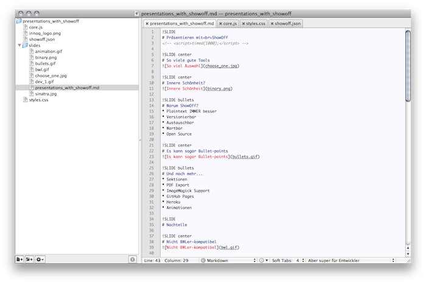

!SLIDE 
# Präsentieren mit ShowOff

!SLIDE center
# So viele gute Tools

!SLIDE center
# Innere Schönheit?

!SLIDE bullets
# Warum ShowOff?
* Plaintext IMMER besser
* Versionierbar
* Austauschbar
* Wartbar
* Open Source

!SLIDE center
# Es kann sogar Bullet-points
    !SLIDE center bullets incremental

!SLIDE bullets
# Und noch mehr...
* Sektionen
* PDF Export
* ImageMagick Support
* GitHub Pages
* Heroku
* Transitions & Animationen

!SLIDE bullets
# Nachteile
* Dokumentationslücken

!SLIDE center
# Nicht BWLer-kompatibel

!SLIDE center
# Aber super für Entwickler

!SLIDE
# Wie funktioniert's?
    $ gem install showoff
    $ showoff create foo
    $ showoff serve
    
!SLIDE center
# Sinatra!

!SLIDE center
# Wie sieht's aus?

!SLIDE
# Syntax
    !SLIDE bullets
    # Warum ShowOff?
    * Plaintext IMMER besser
    * Versionierbar
    * Austauschbar
    * Wartbar
    * Open Source
    
!SLIDE
# Konfiguration
    { 
      "name": "Präsentieren mit ShowOff", 
      "sections": [ {"section":"slides"} ]
    }

!SLIDE transition=scrollLeft center
# Transitions
    @@@ markdown
    !SLIDE transition=scrollLeft center
 

!SLIDE transition=scrollLeft
# Styling
    @@@ css
    .content::before {
        position: absolute;
        left: 0px;
        top: 50px;
        content: url(innoq_logo.png);
    }

!SLIDE
# Scripting
## Pecha Kucha Timer
    @@@ javascript
    function timed(ms) {
        setTimeout(function() {
            nextStep();
            timed(ms);
        }, ms);
    }

    !SLIDE
    

!SLIDE execute
# Scripting
    @@@ javaScript
    result = "foo " + "bar";

!SLIDE bullets
# Infos
* http://github.com/schacon/showoff

!SLIDE center
# Langweilig? Danke :)

Bilder von http://iwdrm.tumblr.com
